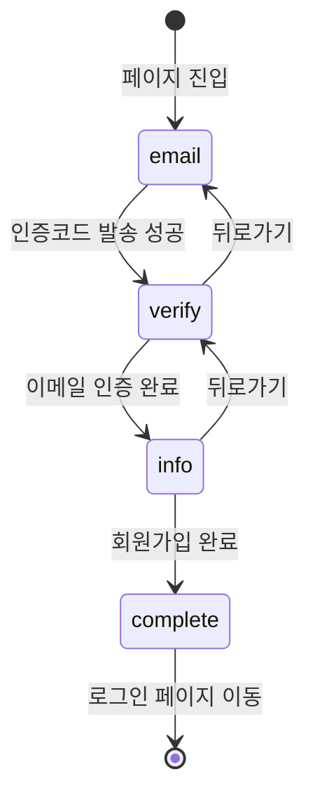

# 회원가입 플로우 문서

> OLA Suite B2B 회원가입 프로세스 구현 가이드

## 📋 목차

- [개요](#개요)
- [플로우 아키텍처](#플로우-아키텍처)
- [디렉토리 구조](#디렉토리-구조)
- [상태 관리](#상태-관리)
- [단계별 구현](#단계별-구현)
- [컴포넌트 API](#컴포넌트-api)
- [디자인 시스템](#디자인-시스템)
- [사용 방법](#사용-방법)
- [API 연동 가이드](#api-연동-가이드)
- [트러블슈팅](#트러블슈팅)

---

## 개요

### 목적

이메일 인증 기반의 안전한 B2B 회원가입 프로세스를 제공합니다.

### 주요 특징

- ✅ **3단계 검증 프로세스**: 이메일 → 인증코드 → 추가 정보
- ✅ **단일 페이지 플로우**: URL 변경 없이 자연스러운 UX
- ✅ **상태 기반 관리**: React Context로 전역 상태 관리
- ✅ **Figma 디자인 완벽 반영**: 디자인 시스템과 100% 일치
- ✅ **접근성 고려**: ARIA 레이블, 키보드 네비게이션 지원
- ✅ **반응형 디자인**: 모바일부터 데스크톱까지 대응

### 기술 스택

- **Framework**: Next.js 13+ (App Router)
- **Language**: TypeScript
- **Styling**: Tailwind CSS
- **State Management**: React Context API
- **UI Components**: Shadcn/ui

---

## 플로우 아키텍처

### 전체 흐름도

```
┌─────────────────────────────────────────────────────────┐
│                    /signup 페이지                        │
│              (SignupFlowProvider)                        │
└─────────────────────────────────────────────────────────┘
                          │
                          ▼
        ┌──────────────────────────────────────┐
        │        Step 1: 이메일 입력           │
        │      (SignupEmailStep)               │
        │                                      │
        │  - 이메일 주소 입력                  │
        │  - 이메일 형식 검증                  │
        │  - 인증코드 발송 API 호출            │
        └──────────────────────────────────────┘
                          │
                    [다음 버튼 클릭]
                          │
                          ▼
        ┌──────────────────────────────────────┐
        │      Step 2: 이메일 인증             │
        │    (SignupVerifyStep)                │
        │                                      │
        │  - 6자리 인증코드 입력               │
        │  - 인증코드 검증 API 호출            │
        │  - 재전송 기능 (60초 타이머)         │
        └──────────────────────────────────────┘
                          │
                    [다음 버튼 클릭]
                          │
                          ▼
        ┌──────────────────────────────────────┐
        │      Step 3: 추가 정보 입력          │
        │     (SignupInfoStep)                 │
        │                                      │
        │  - 이메일 (자동 입력, readonly)      │
        │  - 비밀번호 & 비밀번호 확인          │
        │  - 회사, 부서, 직급                  │
        │  - 이름, 전화번호                    │
        │  - 회원가입 API 호출                 │
        └──────────────────────────────────────┘
                          │
                    [다음 버튼 클릭]
                          │
                          ▼
        ┌──────────────────────────────────────┐
        │         회원가입 완료                │
        │      → /login 페이지 이동            │
        └──────────────────────────────────────┘
```

### 상태 전환 다이어그램



---

## 디렉토리 구조

```
src/
├── contexts/
│   └── SignupFlowContext.tsx          # 회원가입 플로우 상태 관리
│
├── components/auth/
│   ├── AuthCard.tsx                   # 공통 인증 카드 레이아웃
│   ├── VerificationCodeInput.tsx     # 6자리 인증코드 입력 컴포넌트
│   ├── SignupEmailStep.tsx           # Step 1: 이메일 입력
│   ├── SignupVerifyStep.tsx          # Step 2: 인증코드 검증
│   └── SignupInfoStep.tsx            # Step 3: 추가 정보 입력
│
└── app/(auth)/
    ├── layout.tsx                     # 인증 페이지 공통 레이아웃
    ├── login/
    │   └── page.tsx                   # 로그인 페이지
    └── signup/
        └── page.tsx                   # 회원가입 페이지 (플로우 통합)
```

---

## 상태 관리

### SignupFlowContext

회원가입 프로세스의 모든 상태를 중앙에서 관리합니다.

#### State 구조

```typescript
interface SignupFlowState {
  // 현재 단계
  currentStep: 'email' | 'verify' | 'info' | 'complete'
  
  // 사용자 데이터
  email: string
  verificationCode: string
  isEmailVerified: boolean
  
  userInfo: {
    password: string
    passwordConfirm: string
    company: string
    department: string
    position: string
    name: string
    phone: string
  }
  
  // 액션 메서드
  setEmail: (email: string) => void
  setVerificationCode: (code: string) => void
  setEmailVerified: (verified: boolean) => void
  setUserInfo: (info: Partial<UserInfo>) => void
  goToStep: (step: SignupStep) => void
  goToNextStep: () => void
  goToPrevStep: () => void
  reset: () => void
}
```

#### 사용 예시

```typescript
import { useSignupFlow } from '@/contexts/SignupFlowContext'

function MyComponent() {
  const { 
    currentStep, 
    email, 
    setEmail, 
    goToNextStep 
  } = useSignupFlow()
  
  const handleNext = () => {
    setEmail('user@example.com')
    goToNextStep()
  }
}
```

---

## 단계별 구현

### Step 1: 이메일 입력 (SignupEmailStep)

#### 기능

- ✅ 이메일 주소 입력
- ✅ 이메일 형식 검증 (Regex)
- ✅ 인증코드 발송 API 호출
- ✅ Enter 키 지원
- ✅ 로딩 상태 표시

#### 컴포넌트 구조

```typescript
export const SignupEmailStep: React.FC = () => {
  const { email, setEmail, goToNextStep } = useSignupFlow()
  const [localEmail, setLocalEmail] = useState(email)
  const [isLoading, setIsLoading] = useState(false)
  const [error, setError] = useState('')

  const handleNext = async () => {
    // 1. 이메일 검증
    if (!isValidEmail(localEmail)) {
      setError('올바른 이메일 형식이 아닙니다.')
      return
    }
    
    // 2. 인증코드 발송 API 호출
    await sendVerificationCode(localEmail)
    
    // 3. Context 업데이트 & 다음 단계로
    setEmail(localEmail)
    goToNextStep()
  }
}
```

#### UI 요소

| 요소 | 설명 | 상태 |
|------|------|------|
| 이메일 입력 | placeholder: "이메일 주소를 입력해주세요." | 활성화 |
| 안내 문구 | "인증에 사용할 이메일을 적어주세요." | 항상 표시 |
| 다음 버튼 | 배경: 회색(비활성) / 검정(활성) | 이메일 입력 시 활성화 |
| 로그인 링크 | "이미 회원이신가요?" + "로그인 하기" | 항상 표시 |

#### 검증 로직

```typescript
const isValidEmail = (email: string) => {
  const emailRegex = /^[^\s@]+@[^\s@]+\.[^\s@]+$/
  return emailRegex.test(email)
}
```

---

### Step 2: 인증코드 검증 (SignupVerifyStep)

#### 기능

- ✅ 6자리 숫자 인증코드 입력
- ✅ 자동 포커스 이동
- ✅ 인증코드 검증 API 호출
- ✅ 재전송 기능 (60초 쿨타임)
- ✅ 붙여넣기 지원

#### 컴포넌트 구조

```typescript
export const SignupVerifyStep: React.FC = () => {
  const { email, verificationCode, setVerificationCode, goToNextStep } = useSignupFlow()
  const [canResend, setCanResend] = useState(false)
  const [resendTimer, setResendTimer] = useState(60)

  const handleVerify = async () => {
    // 1. 인증코드 검증 API 호출
    const result = await verifyCode(email, verificationCode)
    
    // 2. 검증 성공 시 다음 단계로
    if (result.success) {
      setEmailVerified(true)
      goToNextStep()
    }
  }
}
```

#### VerificationCodeInput 컴포넌트

6자리 개별 입력칸으로 구성된 특수 컴포넌트입니다.

**주요 기능:**
- 숫자만 입력 가능
- 자동 포커스 이동 (다음 칸)
- 백스페이스 처리 (이전 칸)
- 방향키 네비게이션 (← →)
- 붙여넣기 자동 분배
- 입력칸 클릭 시 자동 선택

**Props:**

```typescript
interface VerificationCodeInputProps {
  length?: number        // 코드 길이 (기본: 6)
  value: string          // 현재 값
  onChange: (code: string) => void
  onComplete?: (code: string) => void  // 완성 시 콜백
  disabled?: boolean
}
```

#### UI 요소

| 요소 | 설명 | 상태 |
|------|------|------|
| 인증코드 입력 | 6개의 개별 입력칸 | 활성화 |
| 안내 문구 | "이메일로 발송한 인증코드를 입력해주세요." | 중앙 정렬 |
| 재전송 버튼 | "인증코드를 받지 못하셨나요?" + "재전송" | 60초 타이머 |
| 다음 버튼 | 배경: 회색(비활성) / 검정(활성) | 6자리 입력 시 활성화 |

#### 재전송 타이머

```typescript
useEffect(() => {
  if (resendTimer > 0) {
    const timer = setTimeout(() => {
      setResendTimer(resendTimer - 1)
    }, 1000)
    return () => clearTimeout(timer)
  } else {
    setCanResend(true)
  }
}, [resendTimer])
```

---

### Step 3: 추가 정보 입력 (SignupInfoStep)

#### 기능

- ✅ 이메일 자동 입력 (readonly)
- ✅ 비밀번호 실시간 검증
- ✅ 비밀번호 확인 일치 검증
- ✅ 전체 필드 입력 완료 시 버튼 활성화
- ✅ 회원가입 완료 API 호출

#### 입력 필드

| 필드 | 타입 | 필수 | 검증 규칙 |
|------|------|------|-----------|
| 이메일 | email | ✅ | 자동 입력 (수정 불가) |
| 비밀번호 | password | ✅ | 영문 대소문자 + 특수문자 + 8자 이상 |
| 비밀번호 확인 | password | ✅ | 비밀번호와 일치 |
| 회사 | text | ✅ | - |
| 부서 | text | ✅ | - |
| 직급 | text | ✅ | - |
| 이름 | text | ✅ | - |
| 전화번호 | tel | ✅ | - |

#### 비밀번호 검증 로직

```typescript
const validatePassword = (password: string): boolean => {
  const hasLetter = /[a-zA-Z]/.test(password)
  const hasSpecialChar = /[!@#$%^&*(),.?":{}|<>]/.test(password)
  const isLongEnough = password.length >= 8
  
  return hasLetter && hasSpecialChar && isLongEnough
}
```

#### 실시간 검증

```typescript
const handleChange = (field: string, value: string) => {
  setFormData(prev => ({ ...prev, [field]: value }))
  
  if (field === 'password') {
    if (value && !validatePassword(value)) {
      setPasswordError('영문 대소문자와 특수문자 또한 최소 8자 이상')
    } else {
      setPasswordError('')
    }
  }
}
```

#### 폼 검증

```typescript
const validateForm = (): boolean => {
  // 1. 모든 필드 입력 확인
  if (!formData.password || !formData.company || ...) {
    setError('모든 필드를 입력해주세요.')
    return false
  }
  
  // 2. 비밀번호 규칙 확인
  if (!validatePassword(formData.password)) {
    setError('비밀번호는 영문 대소문자와 특수문자를 포함하여 최소 8자 이상이어야 합니다.')
    return false
  }
  
  // 3. 비밀번호 일치 확인
  if (formData.password !== formData.passwordConfirm) {
    setError('비밀번호가 일치하지 않습니다.')
    return false
  }
  
  return true
}
```

---

## 컴포넌트 API

### SignupFlowProvider

**Props:**
```typescript
{
  children: React.ReactNode
}
```

**Usage:**
```tsx
<SignupFlowProvider>
  <SignupPage />
</SignupFlowProvider>
```

### AuthCard

**Props:**
```typescript
{
  title: string                    // 카드 타이틀
  description: string              // 카드 설명
  children: React.ReactNode        // 카드 콘텐츠
  bottomLogoSrc?: string          // 하단 로고 경로
  showBottomLogo?: boolean        // 하단 로고 표시 여부
}
```

**Usage:**
```tsx
<AuthCard
  title="OLA Suite"
  description="금융 채팅과 리포트 자동화를 하나의 작업공간에서"
>
  <SignupEmailStep />
</AuthCard>
```

### VerificationCodeInput

**Props:**
```typescript
{
  length?: number                  // 코드 길이 (기본: 6)
  value: string                    // 현재 코드 값
  onChange: (code: string) => void
  onComplete?: (code: string) => void
  disabled?: boolean
}
```

**Usage:**
```tsx
<VerificationCodeInput
  value={code}
  onChange={setCode}
  onComplete={(code) => console.log('완료:', code)}
/>
```

---

## 디자인 시스템

### 색상

| 요소 | 색상 | Tailwind 클래스 |
|------|------|-----------------|
| 배경 | 검정 (#000000) | `bg-black` |
| 카드 배경 | 반투명 흰색 (90%) | `bg-white/90` |
| Blur 효과 | 3px | `backdrop-blur-[3px]` |
| 카드 테두리 | 흰색 | `border-white` |
| 레이블 | 회색-900 (#111827) | `text-gray-900` |
| 안내 문구 | 회색-600 (#4B5563) | `text-gray-600` |
| Placeholder | 회색-400 (#9CA3AF) | `placeholder:text-gray-400` |
| 버튼 (활성) | 검정 (#111827) | `bg-gray-900` |
| 버튼 (비활성) | 회색-400 (#9CA3AF) | `bg-gray-400` |

### 타이포그래피

| 요소 | 폰트 크기 | 스타일 |
|------|----------|--------|
| 카드 타이틀 | 16px | Bold |
| 카드 설명 | 14px | Regular |
| 레이블 | 14px | Regular |
| 입력 필드 | 14px | Regular |
| 안내 문구 | 12px | Regular |
| 버튼 | 14px | Bold |

### 간격

| 요소 | 간격 |
|------|------|
| 카드 내부 패딩 | 32px (`p-8`) |
| 섹션 간 간격 | 24px (`gap-6`) |
| 필드 간 간격 | 16px (`gap-4`) |
| 레이블-입력 간격 | 8px (`gap-2`) |

### Border Radius

| 요소 | 반경 |
|------|------|
| 카드 | 20px (`rounded-[20px]`) |
| 입력 필드 | 8px (`rounded-lg`) |
| 버튼 | 8px (`rounded-lg`) |

---

## 사용 방법

### 1. 페이지 접속

```
브라우저에서 /signup 접속
```

### 2. Step 1: 이메일 입력

1. 이메일 주소 입력
2. "다음" 버튼 클릭
3. 서버에서 인증코드 발송 (이메일 확인 필요)

### 3. Step 2: 인증코드 검증

1. 이메일로 받은 6자리 코드 입력
2. 자동으로 다음 칸으로 포커스 이동
3. "다음" 버튼 클릭
4. 서버에서 코드 검증

**재전송이 필요한 경우:**
- "인증코드 재전송" 클릭 (60초 대기 후 가능)

### 4. Step 3: 추가 정보 입력

1. 모든 필드 입력
   - 이메일: 자동 입력됨 (수정 불가)
   - 비밀번호: 영문 대소문자 + 특수문자 + 8자 이상
   - 비밀번호 확인: 비밀번호와 동일하게 입력
   - 회사, 부서, 직급, 이름, 전화번호
2. "다음" 버튼 클릭 (모든 필드 입력 시 활성화)

### 5. 회원가입 완료

- 자동으로 `/login` 페이지로 이동
- 가입한 이메일과 비밀번호로 로그인 가능

---

## API 연동 가이드

### 1. 인증코드 발송 API

**위치:** `SignupEmailStep.tsx` → `handleNext()`

```typescript
// TODO: API 연동
const handleNext = async () => {
  try {
    const response = await fetch('/api/auth/send-verification', {
      method: 'POST',
      headers: { 'Content-Type': 'application/json' },
      body: JSON.stringify({ email: localEmail })
    })
    
    if (!response.ok) throw new Error('Failed to send')
    
    setEmail(localEmail)
    goToNextStep()
  } catch (err) {
    setError('인증코드 발송에 실패했습니다.')
  }
}
```

**API 스펙:**
```
POST /api/auth/send-verification

Request:
{
  "email": "user@example.com"
}

Response:
{
  "success": true,
  "message": "인증코드가 발송되었습니다."
}
```

### 2. 인증코드 검증 API

**위치:** `SignupVerifyStep.tsx` → `handleVerify()`

```typescript
// TODO: API 연동
const handleVerify = async () => {
  try {
    const response = await fetch('/api/auth/verify-code', {
      method: 'POST',
      headers: { 'Content-Type': 'application/json' },
      body: JSON.stringify({
        email,
        code: verificationCode
      })
    })
    
    const result = await response.json()
    
    if (result.success) {
      setEmailVerified(true)
      goToNextStep()
    } else {
      setError('인증코드가 올바르지 않습니다.')
    }
  } catch (err) {
    setError('인증코드 검증에 실패했습니다.')
  }
}
```

**API 스펙:**
```
POST /api/auth/verify-code

Request:
{
  "email": "user@example.com",
  "code": "123456"
}

Response:
{
  "success": true,
  "verified": true
}
```

### 3. 회원가입 완료 API

**위치:** `SignupInfoStep.tsx` → `handleSubmit()`

```typescript
// TODO: API 연동
const handleSubmit = async (e: React.FormEvent) => {
  e.preventDefault()
  
  try {
    const signupData = {
      email,
      password: formData.password,
      company: formData.company,
      department: formData.department,
      position: formData.position,
      name: formData.name,
      phone: formData.phone,
    }
    
    const response = await fetch('/api/auth/signup', {
      method: 'POST',
      headers: { 'Content-Type': 'application/json' },
      body: JSON.stringify(signupData)
    })
    
    const result = await response.json()
    
    if (result.success) {
      setUserInfo(formData)
      router.push('/login')
    } else {
      setError(result.message || '회원가입에 실패했습니다.')
    }
  } catch (err) {
    setError('회원가입에 실패했습니다.')
  }
}
```

**API 스펙:**
```
POST /api/auth/signup

Request:
{
  "email": "user@example.com",
  "password": "SecurePass123!",
  "company": "OLA",
  "department": "개발팀",
  "position": "개발자",
  "name": "홍길동",
  "phone": "010-1234-5678"
}

Response:
{
  "success": true,
  "userId": "user_123",
  "message": "회원가입이 완료되었습니다."
}
```

---

## 트러블슈팅

### 1. 인증코드가 발송되지 않음

**원인:**
- 이메일 서버 연결 실패
- 잘못된 이메일 형식
- API 엔드포인트 오류

**해결 방법:**
1. 이메일 형식 재확인
2. 네트워크 연결 확인
3. 개발자 도구 콘솔에서 API 응답 확인
4. 서버 로그 확인

### 2. 인증코드 입력이 안됨

**원인:**
- 숫자가 아닌 문자 입력 시도
- 입력칸 포커스 문제

**해결 방법:**
1. 숫자만 입력 가능 (자동 필터링됨)
2. 입력칸 클릭하여 포커스 확인
3. 붙여넣기 사용 (Ctrl+V / Cmd+V)

### 3. 비밀번호 검증 실패

**원인:**
- 비밀번호 규칙 미충족

**해결 방법:**
비밀번호는 다음 조건을 모두 충족해야 합니다:
- ✅ 영문 대소문자 포함
- ✅ 특수문자 포함
- ✅ 최소 8자 이상

**예시:**
- ❌ `password123` (특수문자 없음)
- ❌ `Pass!@#` (8자 미만)
- ✅ `Password123!` (모든 조건 충족)

### 4. 다음 버튼이 활성화되지 않음

**Step 1:**
- 이메일이 입력되어야 합니다

**Step 2:**
- 6자리 인증코드가 모두 입력되어야 합니다

**Step 3:**
- 모든 필드가 입력되어야 합니다
- 비밀번호 검증을 통과해야 합니다
- 비밀번호와 비밀번호 확인이 일치해야 합니다

### 5. 페이지 새로고침 시 데이터 사라짐

**원인:**
- Context 상태는 메모리에만 저장됨

**해결 방법:**
필요시 SessionStorage나 LocalStorage에 임시 저장:

```typescript
// SignupFlowContext.tsx 수정
useEffect(() => {
  // 상태 저장
  sessionStorage.setItem('signupFlow', JSON.stringify({
    currentStep,
    email,
    // ...
  }))
}, [currentStep, email])

// 초기화 시 복원
useEffect(() => {
  const saved = sessionStorage.getItem('signupFlow')
  if (saved) {
    const data = JSON.parse(saved)
    // 상태 복원
  }
}, [])
```

---

## 버전 히스토리

### v1.0.0 (2025-01-11)

**초기 구현:**
- ✅ 3단계 회원가입 플로우 구현
- ✅ Context 기반 상태 관리
- ✅ Figma 디자인 완벽 반영
- ✅ 6자리 인증코드 입력 컴포넌트
- ✅ 비밀번호 실시간 검증
- ✅ 재전송 타이머 기능

---

## 참고 자료

- [Figma 디자인 시스템](https://www.figma.com/design/NQ8NSfwkFxiqhor5w8LjIx/OneLineAI-B2B)
- [Next.js App Router 문서](https://nextjs.org/docs/app)
- [React Context API](https://react.dev/reference/react/createContext)
- [Tailwind CSS 문서](https://tailwindcss.com/docs)

---

## 라이센스

© 2025 OneLineAI. All rights reserved.

